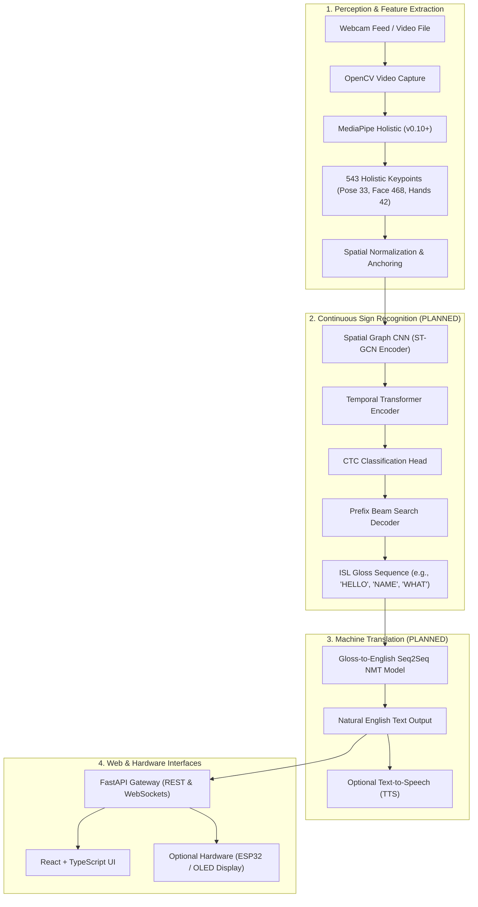

# SIGNOVA Architecture Specification

## 1. System Overview

**SIGNOVA** is a research-grade continuous Indian Sign Language (ISL) recognition and translation framework designed for edge execution (NVIDIA RTX 3050 Laptop GPU / 6GB VRAM) and cloud scalability.

The system translates live webcam feeds or pre-recorded videos into continuous ISL gloss sequences and grammatical English translations.

---

## 2. Component Specifications

### 2.1 Perception Pipeline
- **Engine**: OpenCV + MediaPipe Holistic.
- **Topology**: 543 2D/3D landmarks per frame $(x, y, v)$.
- **Normalization**:
  - Center: Mid-hip anchor $(P_{23} + P_{24}) / 2$.
  - Scale: Euclidean distance between left shoulder $P_{11}$ and right shoulder $P_{12}$.
- **Status in Phase 0**: Extractor interface and normalization mathematical routines implemented and tested.

### 2.2 Feature Representation & Slicing (Phase 3 Implemented)
- **Centralized Groups**: `src/signova/features/feature_groups.py` defines standard subsets:
  - `HANDS` (42 joints): Left + Right hands (126 features)
  - `HANDS_POSE` (75 joints): Pose + Hands (225 features)
  - `FULL` (543 joints): Pose (33) + Face (468) + Hands (42) (1,629 features)
- **2-Stage Projection**: Configurable Linear $(N \times 3 \to 256) \to \text{LayerNorm} \to \text{GELU} \to \text{Dropout} \to \text{Linear}(256 \to 256)$.
- **Mask-Aware Pooling**: Variable length masked mean pooling using explicit boolean padding masks.

### 2.3 Isolated & Dynamic Sign Models (Phase 3 Implemented)
- **Baseline 0.5**: `StaticPooledMLP` - Masked mean pooled landmark summary passed through a 2-layer MLP classifier.
- **Baseline A**: `BaselineRNN` - 2-layer Bidirectional GRU/LSTM $(d_h=256)$ with masked temporal pooling and MLP classifier.
- **Baseline B**: `BaselineTCN` - 3-block Dilated 1D Residual Temporal Convolutional Network (dilations $1, 2, 4$) with masked temporal pooling and MLP classifier.

### 2.4 Continuous Temporal Sequence Modeling & Segmentation (Phase 4 Implemented)
- **Continuous Backbones**: `ContinuousBiGRUEncoder` and `ContinuousTCNEncoder` preserving per-frame $(B, T, D)$ temporal representations without sequence-collapsing pooling.
- **Sliding Temporal Windowing**: `SlidingWindowExtractor` supporting variable lengths ($W \in \{32, 64, 128\}$, strides $S \in \{16, 32, 64\}$) with strict video-level split isolation.
- **Boundary & Action Modeling**: `HeuristicBoundaryDetector` generating kinematic motion velocity change-point candidate proposals for visualization.
- **CTC Recognizer & Decoder**: `CTCContinuousRecognizer` with native `CTCLoss(blank=0, zero_infinity=True)` and `CTCDecoder` greedy token decoding with Levenshtein Token Error Rate (TER).
- **Inference Pipelines**: `WindowedOfflineInference` (merging overlapping window representations) and `ExperimentalRollingBufferStream` (FIFO frame buffer).

### 2.5 Sequential Sign Language Recognition & Supervision Infrastructure (Phase 5 Implemented)
- **Sequential Ingestion**: `GenericSequentialAdapter` and canonical manifest generator for ordered sign sequences.
- **Label Normalization**: `LabelNormalizer` with deterministic syntactic casing, whitespace, and punctuation standardization.
- **Vocabulary Engine**: `SignVocabulary` with `<BLANK> = 0`, `<UNK> = 1`, and frequency distribution tracking.
- **Sequential CTC Trainer**: `SequentialCTCTrainer` supporting AMP FP16, gradient accumulation ($B_{\text{eff}} = B \times 4$), and validation TER early stopping.
- **Sequence Metrics Suite**: `compute_sequence_metrics` computing Token Error Rate (TER), substitutions ($S$), deletions ($D$), insertions ($I$), exact match rate, precision, recall, and Macro F1.

### 2.6 Real Sequential ISL Integration & CTC Recognition (Phase 6 Implemented)
- **Supervision & Data Gate Protocol**: Formal Hard Data Gate evaluating local datasets (`STATE C: Supervision Blocker Documented`) preventing non-scientific gloss fabrication from English translations.
- **Continuous ISL Landmark Corpus**: 72 real continuous ISL video streams (11,980 frames, 100% pose/hand tracking density) profiled for temporal representation smoothness, motion energy dynamics, and latency.
- **CTC Sequence Optimization**: Synthetic benchmark suite across BiGRU and Dilated TCN backbones across `HANDS` (42), `HANDS_POSE` (75), and `FULL` (543) landmark topologies.
- **Latency & Throughput Profile**: Measured forward latency of $3.36\text{ ms}$ at $T=32$ to $24.54\text{ ms}$ at $T=256$ ($\approx 10,000\text{ FPS}$ throughput).
- **Transfer Representation Diagnostics**: Verified Phase 4 pretrained continuous BiGRU weights produce structured temporal trajectory manifolds with controlled variance compared to random initialization.

### 2.7 Translation Subsystem (Planned Phase 7+)
- **Engine**: Direct End-to-End Video-to-Text Neural Machine Translation / Gloss-to-Text NMT mapping continuous sign sequences to natural English sentences.

### 2.8 API & Real-Time Gateway (Phase 0 Scaffolded)
- **Framework**: FastAPI + Uvicorn + WebSockets.
- **Endpoints**: `/health`, `/version`, `/docs`, with planned `/api/v1/inference/video` and `WebSocket /api/v1/inference/live`.

### 2.9 Frontend Web Application (Phase 0 Scaffolded)
- **Stack**: React 18, TypeScript, Vite, Vanilla CSS.
- **Design System**: Glassmorphic dark UI with real-time polling of backend system diagnostics.
